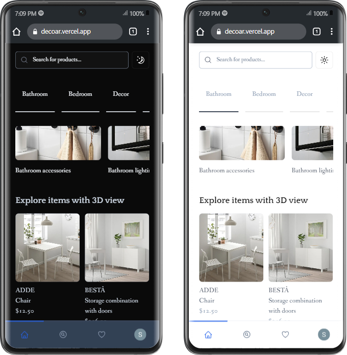
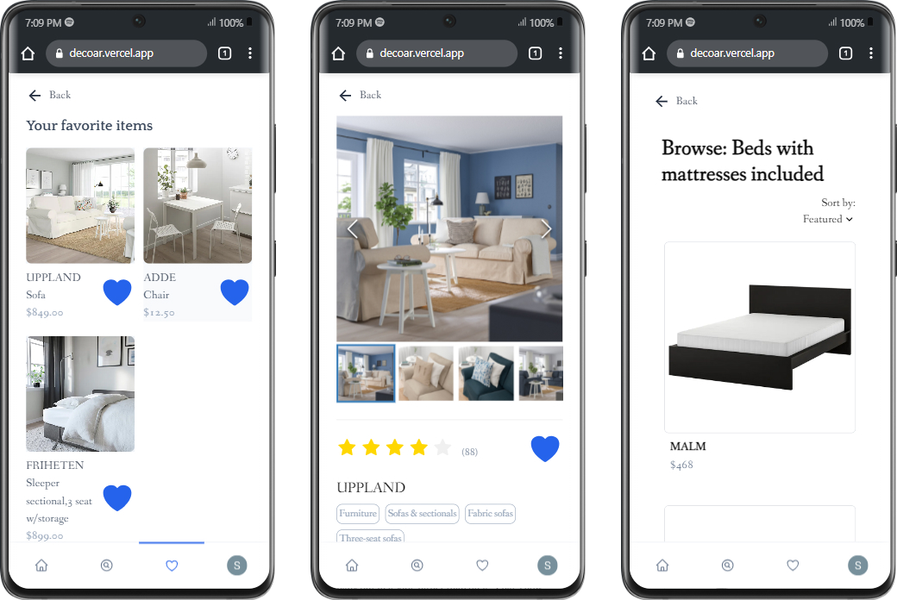
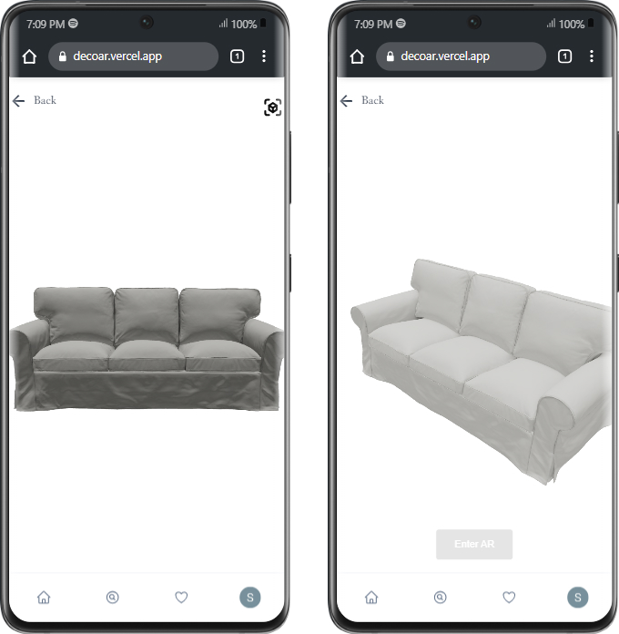

<a id="readme-top"></a>

<br />
<div align="center">
  <a href="https://github.com/DecorAR-Team/DecoAR">
    
  </a>

<h3 align="center">DecoAR</h3>

  <p align="center">
    Transform your space with DecoAR: visualize and customize furniture in your home using augmented reality!
    <br />
    <br />
    <a href="https://github.com/DecorAR-Team/DecoAR">View Demo</a>
    ·
    <a href="https://github.com/DecorAR-Team/DecoAR/issues/new">Report Bug</a>
    <!-- <a href="https://github.com/github_username/repo_name/issues/new?labels=enhancement&template=feature-request---.md">Request Feature</a> -->
  </p>
</div>

<!-- TABLE OF CONTENTS -->
<details>
  <summary>Table of Contents</summary>
  <ol>
    <li>
      <a href="#about-the-project">About The Project</a>
      <ul>
        <li><a href="#built-with">Built With</a></li>
      </ul>
    </li>
    <li>
      <a href="#getting-started">Getting Started</a>
      <ul>
        <li><a href="#prerequisites">Prerequisites</a></li>
        <li><a href="#installation">Installation</a></li>
      </ul>
    </li>
    <li><a href="#usage">Usage</a></li>
    <li><a href="#contributing">Contributing</a></li>
    <li><a href="#license">License</a></li>
    <li><a href="#contact">Contact</a></li>
  </ol>
</details>

<!-- ABOUT THE PROJECT -->

## About The Project

DecoAR is a cutting-edge web application that harnesses augmented reality (AR) technology to help users visualize furniture and decor in their own living spaces before making a purchase. Browse through a comprehensive catalog of products, view high-quality 3D models, and place them in your environment using your device's camera.

<div align='center'>
<br><br>
<br><br>

</div>

<p align="right">(<a href="#readme-top">back to top</a>)</p>

### Built With

- [![TypeScript][TypeScript]][TypeScript-url]
- [![Next.js][Next.js]][Next-url]
- [![Git][Git]][Git-url]
- [![GitHub][GitHub]][GitHub-url]
- [![Shadcn][Shadcn]][Shadcn-url]
- [![ESLint][ESLint]][ESLint-url]
- [![Prettier][Prettier]][Prettier-url]

<p align="right">(<a href="#readme-top">back to top</a>)</p>

<!-- GETTING STARTED -->

## Getting Started

Follow these easy steps to get a local copy up and running.

### Prerequisites

- npm ([Link])(https://docs.npmjs.com/downloading-and-installing-node-js-and-npm))

  ```sh
  npm install npm@latest -g
  ```

### Installation

1. Get a free API Key at [https://example.com](https://example.com)
2. Clone the repo
   ```sh
   git clone git@github.com:DecorAR-Team/DecoAR.git
   ```
3. Install NPM packages
   ```sh
   npm install
   ```
4. Enter your API in `.env.local`
   ```js
   const API_KEY = 'ENTER YOUR API';
   ```

<p align="right">(<a href="#readme-top">back to top</a>)</p>

<!-- USAGE EXAMPLES -->

## Usage

Use this space to show useful examples of how a project can be used. Additional screenshots, code examples and demos work well in this space. You may also link to more resources.

_For more examples, please refer to the [Documentation](https://example.com)_

<p align="right">(<a href="#readme-top">back to top</a>)</p>

<!-- CONTRIBUTING -->

## Contributing

Contributions are what make the open source community such an amazing place to learn, inspire, and create. Any contributions you make are **greatly appreciated**.

If you have a suggestion that would make this better, please fork the repo and create a pull request. You can also simply open an issue with the tag "enhancement".
Don't forget to give the project a star! Thanks again!

1. Fork the Project
2. Create your Feature Branch (`git checkout -b feature/AmazingFeature`)
3. Commit your Changes (`git commit -m 'Add some AmazingFeature'`)
4. Push to the Branch (`git push origin feature/AmazingFeature`)
5. Open a Pull Request

<p align="right">(<a href="#readme-top">back to top</a>)</p>

<!-- LICENSE -->

## License

Distributed under the MIT License. See `LICENSE.txt` for more information.

<p align="right">(<a href="#readme-top">back to top</a>)</p>

<!-- CONTACT -->

## Contact

Charbel - [@twitter_handle](https://twitter.com/twitter_handle) - email@email_client.com
Project Link: [https://github.com/github_username/repo_name](https://github.com/github_username/repo_name)

Sulo - [@twitter_handle](https://twitter.com/twitter_handle) - email@email_client.com
Project Link: [https://github.com/github_username/repo_name](https://github.com/github_username/repo_name)

Tetiana - [@twitter_handle](https://twitter.com/twitter_handle) - email@email_client.com
Project Link: [https://github.com/github_username/repo_name](https://github.com/github_username/repo_name)

Sindhu - [@twitter_handle](https://twitter.com/twitter_handle) - email@email_client.com
Project Link: [https://github.com/github_username/repo_name](https://github.com/github_username/repo_name)
