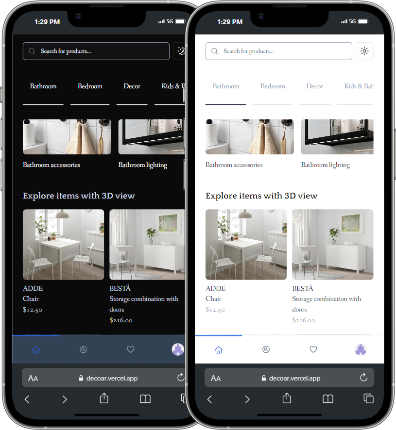
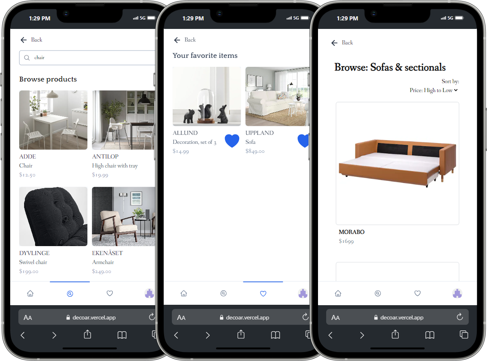
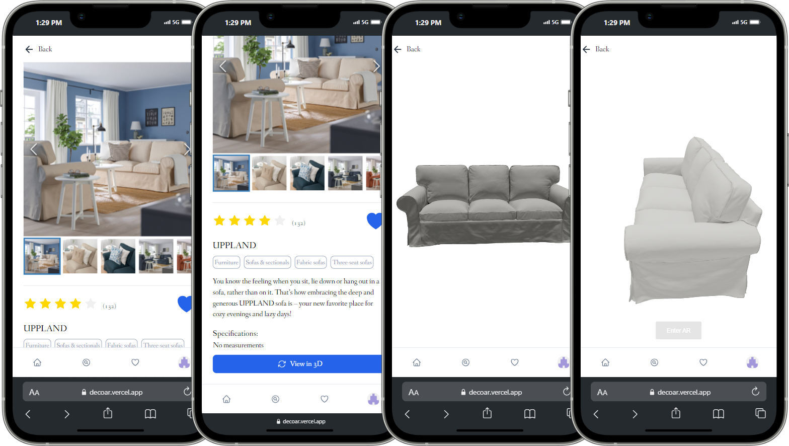

<a id="readme-top"></a>

<br />
<div align="center">
  <a href="https://github.com/DecorAR-Team/DecoAR">
    
  </a>

<h3 align="center">DecoAR</h3>

  <p align="center">
    Transform your space with DecoAR: visualize and customize furniture in your home using augmented reality!
    <br />
    <br />
    <a href="https://github.com/DecorAR-Team/DecoAR">View Demo</a>
    ·
    <a href="https://github.com/DecorAR-Team/DecoAR/issues/new">Report Bug</a>
    <!-- <a href="https://github.com/github_username/repo_name/issues/new?labels=enhancement&template=feature-request---.md">Request Feature</a> -->
  </p>
</div>

<!-- TABLE OF CONTENTS -->
<details>
  <summary>Table of Contents</summary>
  <ol>
    <li>
      <a href="#about-the-project">About The Project</a>
      <ul>
        <li><a href="#built-with">Built With</a></li>
      </ul>
    </li>
    <li>
      <a href="#getting-started">Getting Started</a>
      <ul>
        <li><a href="#prerequisites">Prerequisites</a></li>
        <li><a href="#installation">Installation</a></li>
      </ul>
    </li>
    <li><a href="#usage">Usage</a></li>
    <li><a href="#contributing">Contributing</a></li>
    <li><a href="#license">License</a></li>
    <li><a href="#contact">Contact</a></li>
  </ol>
</details>

<!-- ABOUT THE PROJECT -->

## About The Project

DecoAR is a web application that harnesses augmented reality (AR) technology to help users visualize furniture and decor in their own living spaces before making a purchase. Browse through a comprehensive catalog of products, view high-quality 3D models, and place them in your environment using your device's camera.

<div align='center'>
 <br>
 <br>
<br>
</div>

<p align="right">(<a href="#readme-top">back to top</a>)</p>

### Built With

[![Next.js][Next.js]][Next-url]
[![TypeScript][TypeScript]][TypeScript-url]
[![Redux][Redux]][Redux-url]
[![ClerkAuth][ClerkAuth]][ClerkAuth-url]
[![Prisma][Prisma]][Prisma-url]
[![MongoDB][Mongo-Db]][Mongo-Db-url]
[![Threejs][Threejs]][Threejs-url]
[![TailwindCSS][TailwindCSS]][TailwindCSS-url]
[![Vercel][Vercel]][Vercel-url]
[![Git][Git]][Git-url]
[![GitHub][GitHub]][GitHub-url]
[![Shadcn][Shadcn]][Shadcn-url]
[![ESLint][ESLint]][ESLint-url]
[![Prettier][Prettier]][Prettier-url]

<p align="right">(<a href="#readme-top">back to top</a>)</p>

<!-- GETTING STARTED -->

## Getting Started

Follow these easy steps to get a local copy up and running.

### Prerequisites

- [npm](https://docs.npmjs.com/downloading-and-installing-node-js-and-npm)

  ```sh
  npm install npm@latest -g
  ```

- Obtain API key for

  - [Clerk Authentication](https://dashboard.clerk.com/):
    Create an project and get Clerk_Publishable_key and Clerk_Security_Key

### Installation

1. Clone the repo

   ```sh
   git clone git@github.com:DecorAR-Team/DecoAR.git
   ```

2. Create your own .env file and copy the description below replacing the placeholder information with the Clerk Api Keys and database connection URI:

   ```sh
   MONGODB_URI=[ENTER_MONGODB_CONNECTION_STRING]
   NEXT_PUBLIC_CLERK_PUBLISHABLE_KEY=[ENTER_CLERK_PUBLISHABLE_KEY]
   CLERK_SECRET_KEY=[ENTER_CLERK_SECRET_KEY]
   NEXT_PUBLIC_CLERK_SIGN_IN_URL=/sign-in
   NEXT_PUBLIC_CLERK_SIGN_UP_URL=/sign-up
   ```

3. Install NPM packages

   ```sh
   npm install
   ```

4. Database Setup

- Before running the project locally, you need to create a MongoDB database named "decoar".

- Inside the decoar database, create the following collections:

  ```sh
  Category
  Product
  ProductWith3d
  Subcategory
  SubcategoryWithProductIds
  ```

- Insert JSON data into the collections:
  ```
  Navigate to each collection (e.g., Category) in MongoDB Compass.
  Click on Add Data and then Import File.
  Select the appropriate JSON file from lib/json directory on your local machine and click Open.
  Repeat this process for each collection, importing the corresponding JSON files.
  ```

5. Start the app
   ```sh
   npm run dev
   ```

<p align="right">(<a href="#readme-top">back to top</a>)</p>

<!-- CONTRIBUTING -->

## Contributing

Contributions are what make the open source community such an amazing place to learn, inspire, and create. Any contributions you make are **greatly appreciated**.

If you have a suggestion that would make this better, please fork the repo and create a pull request. You can also simply open an issue with the tag "enhancement".
Don't forget to give the project a star! Thanks again!

1. Fork the Project
2. Create your Feature Branch (`git checkout -b feature/AmazingFeature`)
3. Commit your Changes (`git commit -m 'Add some AmazingFeature'`)
4. Push to the Branch (`git push origin feature/AmazingFeature`)
5. Open a Pull Request

<p align="right">(<a href="#readme-top">back to top</a>)</p>

<!-- LICENSE -->

## License

Distributed under the MIT License. See `license.txt` for more information.

<p align="right">(<a href="#readme-top">back to top</a>)</p>

<!-- CONTACT -->

## Contact

DecoAr Organization: [Github](https://github.com/DecorAR-Team/DecoAR) - [LinkedIn](https://www.linkedin.com/company/decoar-team) - decoarteam@gmail.com

Tetiana Bortnyk - [Github](https://github.com/tatyanabortnik) - [LinkedIn](https://www.linkedin.com/in/tetianabortnyk/) - tatyanabortnik@gmail.com

Sindhu Yogu - [Github](https://github.com/Sind96) - [LinkedIn](www.linkedin.com/in/sindhu-yogu-657057318) - sindy96jan@gmail.com

Sulo Siguur- [Github](https://github.com/Runicsaber) - [LinkedIn](https://www.linkedin.com/in/sulo-siigur-34a932225/) - sulo.siigur@gmail.com

Charbel Rouhana - [Github](https://github.com/Charbel-r) - [LinkedIn](https://www.linkedin.com/in/charbel-rouhana-0b6311135/) - charbelmrouhana@gmail.com

<!-- MARKDOWN LINKS & IMAGES -->
<!-- https://www.markdownguide.org/basic-syntax/#reference-style-links -->

[React.js]: https://img.shields.io/badge/React-20232A?style=for-the-badge&logo=react&logoColor=61DAFB
[React-url]: https://reactjs.org/
[ESLint]: https://img.shields.io/badge/eslint-3A33D1?style=for-the-badge&logo=eslint&logoColor=white
[ESLint-url]: https://eslint.org/
[Prettier]: https://img.shields.io/badge/prettier-1A2C34?style=for-the-badge&logo=prettier&logoColor=F7BA3E
[Prettier-url]: https://prettier.io/
[TypeScript-url]: https://www.typescriptlang.org/
[TypeScript]: https://shields.io/badge/TypeScript-3178C6?logo=TypeScript&logoColor=FFF&style=for-the-badge
[Next.js]: https://img.shields.io/badge/next.js-000000?style=for-the-badge&logo=nextdotjs&logoColor=white
[Next-url]: https://nextjs.org/
[Git-url]: https://git-scm.com/
[Git]: https://img.shields.io/badge/GIT-E44C30?style=for-the-badge&logo=git&logoColor=white
[GitHub-url]: https://github.com/
[GitHub]: https://img.shields.io/badge/GitHub-100000?style=for-the-badge&logo=github&logoColor=white
[Shadcn-url]: https://ui.shadcn.com/
[Shadcn]: https://img.shields.io/badge/shadcn%2Fui-000?logo=shadcnui&logoColor=fff&style=for-the-badge
[Redux]: https://img.shields.io/badge/redux-%23593D88?style=for-the-badge&logo=redux&logoColor=white
[Redux-url]: https://redux-toolkit.js.org/
[ClerkAuth]: https://img.shields.io/badge/Clerk-6C47FF?logo=clerk&logoColor=fff&style=for-the-badge
[ClerkAuth-url]: https://clerk.com/
[Mongo-Db]: https://img.shields.io/badge/MongoDB-%234ea94b.svg?style=for-the-badge&logo=mongodb&logoColor=white
[Mongo-Db-url]: https://www.mongodb.com/docs/atlas/getting-started/
[Threejs]: https://img.shields.io/badge/threejs-black?style=for-the-badge&logo=three.js&logoColor=white
[Threejs-url]: https://threejs.org/
[TailwindCSS]: https://img.shields.io/badge/tailwindcss-%2338B2AC.svg?style=for-the-badge&logo=tailwind-css&logoColor=white
[TailwindCSS-url]: https://tailwindcss.com/docs/installation
[Vercel]: https://img.shields.io/badge/vercel-%23000000.svg?style=for-the-badge&logo=vercel&logoColor=white
[Vercel-url]: https://vercel.com/docs
[Prisma]: https://img.shields.io/badge/Prisma-3982CE?style=for-the-badge&logo=Prisma&logoColor=white
[Prisma-url]: https://www.prisma.io/docs
